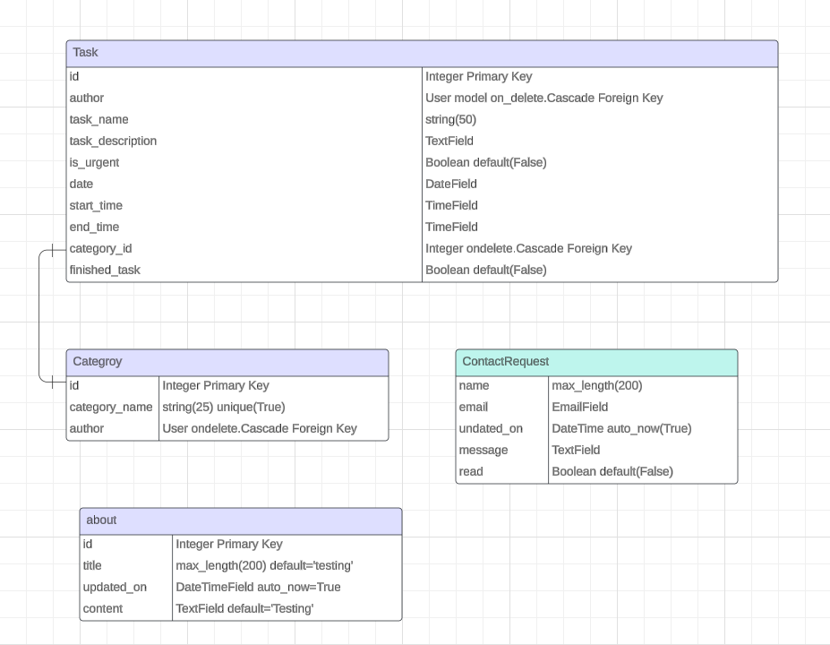
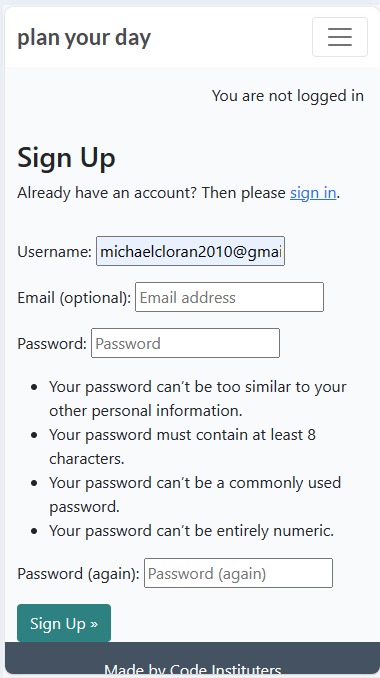

# Welcome

## Scope of project

This project aims to help you plan your day via timed tasks for today and tomorrow. When you first start it, register and login you will be on the home page and it will show a blank task list where you can add tasks for today. But the real power in this task list is to plan the next days workload the night before. This will allow a daily schedule for a say developer to follow!.

Note: That the tasks are timed and it will be possible to show stats on a daily/weekly/monthly basis. For instance how many hours in the week did you work on Code Institute's LMS. How many hours did you work on PP4 etc!.

## Epics
- 1. As a customer of the site I can register an account and then I have the ability to login and logout
- 2. As a customer of the site I can manage tasks and categories via forms
- 3. As a customer once I have entered tasks with categories I can view statistics on a task category by a given time frame
- 4. As a customer I can view the site and use the about nav link and I can fill in the form to contact the site owner

## User Stories

- 1. Account registration: As a site user I can register an account so that I can login and manage tasks and categories of a task
    - with a registration form with user, email and password fields a user can register an account request
    - then the user can login
    - when the user is logged in they can view and manage tasks and categories of task

- 1. Login/Logout: As a site user I can login and logout of the site given correct details
    - As a registered User of the site I can login and logout

- 2. Manage tasks: As a site user once logged in I can create, read, update and delete tasks so that I can manage my task list
    - As a logged in user. I can create a task
    - As a logged in user. I can read my tasks and notes
    - As a logged in user. I can update a task
    - As a logged in user. I can delete a task

- 2. Manage categories: As a site user once logged in I can create, read, update and delete categories so that I can manage category lists to be able to organize tasks better
    - As a logged in user. I can add a category
    - As a logged in user. I can view categories
    - As a logged in user. I can update a category
    - As a logged in user. I can delete a category: CAUTION HERE: As in the entity relationship diagrams I have it wired so that if there is tasks with this category the tasks will also be deleted!!.

- 2. Open a task: As a site user, I can click on a task so that I can read the notes related to a task
    - When the task in the task list is clicked on a detailed view of the task is shown with the notes for the task visible.

- 2. Modify or delete a task: As a site user I can modify and delete a task
    - As a logged in user, The user can modify their task
    - As a logged in user, The user can delete a task

- 3. View statistics: As a site user once logged in, I can click on the view stats nav link and view stats
    - As a logged in user. I can from a form select a category of task and the amount of days I want to run the summing for and the end result is to get a stat with the number of minutes and hours spent at that task in the given time frame

- 4. View About Site Link: As a site user I can click on the about nav link to see the about site details
    - As a site user I can view the about details of the site
    - As a site user I can fill in the contact site form

## Entity Relationship Diagrams ERD's

## Wireframes

Home and Login
Desktop

Mobile

About and Contact Form
Desktop

Mobile

Register
Desktop

Mobile

Task List Home
Desktop

Mobile

Categories List
Desktop

Mobile

Add and Edit a Category
Desktop

Mobile

Delete Category
Desktop

Mobile

Add Edit and View Task
Desktop

Mobile

Statistics
Desktop

Mobile

Delete Task
Desktop

Mobile

## Some bugs found while doing project

- Kanban board bug

If you look very closely at above image you will notice for instance under In progress EPIC 1 above the text EPIC 1 you can see django-blog. This is the repo that the kanban board is associated with. This is confusing as in repo plan-your-day if you click on Project then this Kanban board shows up.

In order to fix the above issue I had to delete all the entries in the Kanban board and as I was adding them again on a per instance basis I had to associate them with a repo plan-your-day. This was a very tricky bug and very easy to miss!!

- Database Unique=True issue

During my development of the database models I came across an issue where I set the category_name and task_name to unique. This seemed innocent enough as each user would have a unique set of tasks and categories. But this was not the full picture as at the database level each task_name and category_name has to be unique when the value is unique=True. So I was getting collisions when multi-user use was tested. My way of resolving the issue was to remove the unique=True from the models fields for category_name and task_name and to allow the user to manage the tasks and categories at their own discretion.

## The manual for the system.
 website url: https://plan-your-day-95966d08599e.herokuapp.com/

 when you load the above page it asks you to login or register to login

 login screen desktop

 

login screen mobile

register screen desktop

register screen mobile

