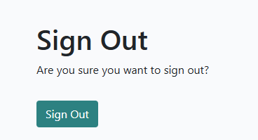
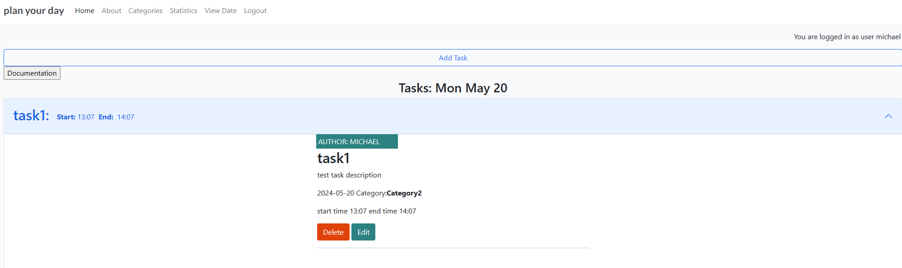
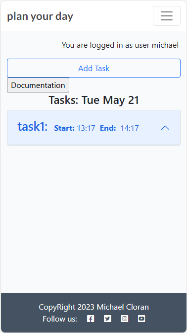
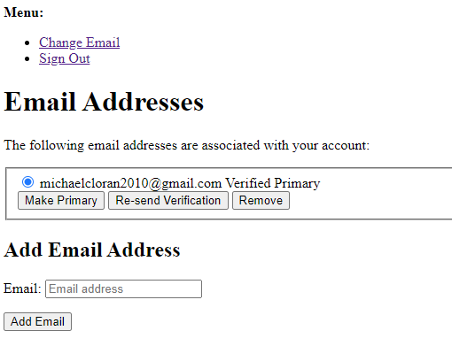
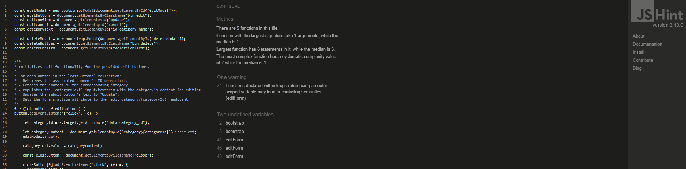
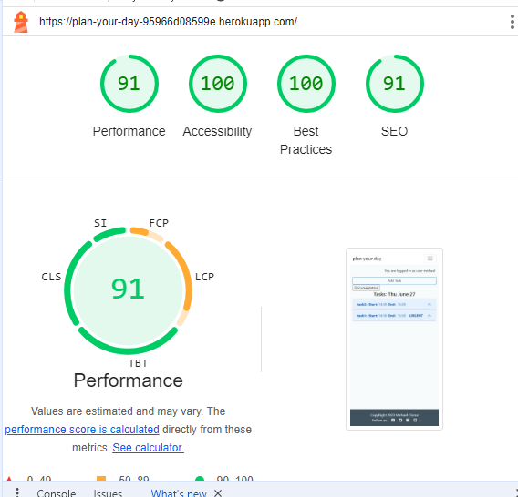
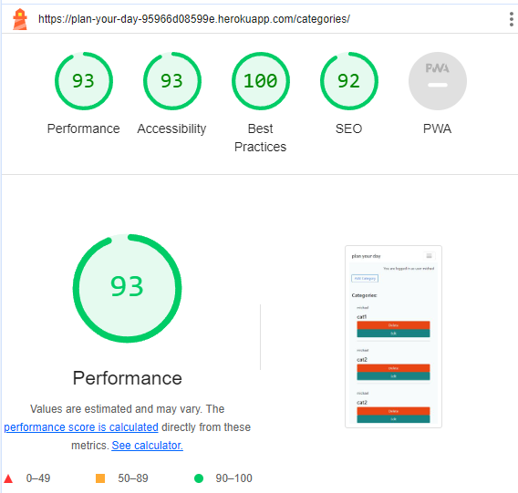

# Welcome

- [Welcome](#welcome)
  * [Scope of project](#scope-of-project)
  * [Epics](#epics)
  * [User Stories](#user-stories)
  * [Design](#design)
  * [Color Scheme](#color-scheme)
  * [Typography](#typography)
  * [Entity Relationship Diagrams ERD's](#entity-relationship-diagrams-erd-s)
  * [Wireframes](#wireframes)
  * [Some bugs found while doing project](#some-bugs-found-while-doing-project)
  * [Features](#features)
    + [Header](#header)
      - [Navigation bar](#navigation-bar)
      - [Navigation bar not logged in.](#navigation-bar-not-logged-in)
      - [Navigation bar logged in.](#navigation-bar-logged-in)
    + [login and register pages](#login-and-register-pages)
    + [logout navbar choice](#logout-navbar-choice)
    + [Register page](#register-page)
    + [Home Page](#home-page)
    + [About Page](#about-page)
    + [Categories page](#categories-page)
    + [Statistics page](#statistics-page)
    + [View Date page](#view-date-page)
    + [Footer](#footer)
    + [500 page](#500-page)
    + [404 page](#404-page)
    + [403 page](#403-page)
    + [Admin page](#admin-page)
  * [The manual for the system.](#the-manual-for-the-system)
  * [Testing](#testing)
    + [Validation of code](#validation-of-code)
    + [HTML](#html)
    + [Login page](#login-page)
    + [Register](#register)
    + [Home page](#home-page)
    + [Add Task](#add-task)
    + [About page](#about-page)
    + [Categories page](#categories-page-1)
    + [Add Category](#add-category)
    + [Statistics page](#statistics-page-1)
    + [View Date page](#view-date-page-1)
    + [Logout page](#logout-page)
    + [500 page](#500-page-1)
    + [404 page](#404-page-1)
    + [CSS](#css)
    + [JavaScript](#javascript)
    + [category.js](#categoryjs)
    + [tasks.js](#tasksjs)
    + [Python](#python)
    + [About admin](#about-admin)
    + [About forms](#about-forms)
    + [About models](#about-models)
    + [About urls](#about-urls)
    + [About views](#about-views)
    + [Tasks admin](#tasks-admin)
    + [Tasks forms](#tasks-forms)
    + [Tasks models](#tasks-models)
    + [Tasks urls](#tasks-urls)
    + [Tasks views](#tasks-views)
    + [Lighthouse](#lighthouse)
      - [login desktop](#login-desktop)
      - [login mobile](#login-mobile)
      - [register desktop](#register-desktop)
      - [register mobile](#register-mobile)
      - [logout desktop](#logout-desktop)
      - [logout mobile](#logout-mobile)
      - [Home desktop](#home-desktop)
      - [Home mobile](#home-mobile)
      - [About desktop](#about-desktop)
      - [About mobile](#about-mobile)
      - [Categories desktop](#categories-desktop)
      - [Categories mobile](#categories-mobile)
      - [Statistics desktop](#statistics-desktop)
      - [Statistics mobile](#statistics-mobile)
      - [View Date desktop](#view-date-desktop)
      - [View Date mobile](#view-date-mobile)
    + [Wave Webaim - accessibility testing](#wave-webaim---accessibility-testing)
    + [Manual Testing](#manual-testing)
      - [Navigation bar](#navigation-bar-1)
      - [Login page](#login-page-1)
      - [Register page](#register-page-1)
      - [Logout page](#logout-page-1)
      - [Home Page](#home-page-1)
      - [Add Task form](#add-task-form)
      - [Documentation button](#documentation-button)
      - [Tasks](#tasks)
      - [Task Edit](#task-edit)
      - [Task delete](#task-delete)
      - [About Page](#about-page-1)
      - [Categories Page](#categories-page)
      - [Add Category](#add-category-1)
      - [Statistics Page](#statistics-page)
      - [View Date Page](#view-date-page)
      - [404 Page](#404-page)
      - [500 Page](#500-page)
      - [Footer](#footer-1)
    + [Technologies Used](#technologies-used)
    + [Deployment](#deployment)
    + [Credits](#credits)

<small><i><a href='http://ecotrust-canada.github.io/markdown-toc/'>Table of contents generated with markdown-toc</a></i></small>

## Scope of project

project URL (https://plan-your-day-95966d08599e.herokuapp.com/)

This project aims to help you plan your day via timed tasks for today and tomorrow or a particular date. When you first start it, register and login you will be on the home page and it will show a blank task list where you can add tasks for today. But the real power in this task list is to plan the next days workload the night before. This will allow a daily schedule for a say developer to follow!.

Note: That the tasks are timed and it will be possible to show stats on a daily/weekly/monthly basis. For instance how many hours in the week did you work on Code Institute's LMS. How many hours did you work on PP4 etc!.

Note: For this system to work you have to create categories say job1, job2 etc and when you create a task then you choose a job and time window for that job on a particular date. Where the description for the job would narrow down what you are going to do in that time window. Then when you want to see a breakdown of tasks for a particular job you can navigate to statistics and choose a date from and to and a job and then you will get a tabulated results for each task for that job within the dates chosen and the hours and minutes are shown and date and task in a table and at the end they are totaled to show total hours and minutes on a particular job within the dates chosen.

Jobs could be projects todo over a long period of time, where you can multitask the jobs/projects on a daily basis within time windows per day. The description would be crucial here to break down what exactly needs to be done within the time window on a particular date.

## Epics
- 1. As a customer of the site I can register an account and then I have the ability to login and logout
- 2. As a customer of the site I can manage tasks and categories via forms
- 3. As a customer once I have entered tasks with categories I can view statistics on a task category by a given time frame
- 4. As a customer I can view the site and use the about nav link and I can fill in the form to contact the site owner

## User Stories

- 1. Account registration: As a site user I can register an account so that I can login and manage tasks and categories of a task
    - with a registration form with user, email and password fields a user can register an account request
    - then the user can login
    - when the user is logged in they can view and manage tasks and categories of task

- 1. Login/Logout: As a site user I can login and logout of the site given correct details
    - As a registered User of the site I can login and logout

- 2. Manage tasks: As a site user once logged in I can create, read, update and delete tasks so that I can manage my task list
    - As a logged in user. I can create a task
    - As a logged in user. I can read my tasks and notes
    - As a logged in user. I can update a task
    - As a logged in user. I can delete a task

- 2. Manage categories: As a site user once logged in I can create, read, update and delete categories so that I can manage category lists to be able to organize tasks better
    - As a logged in user. I can add a category
    - As a logged in user. I can view categories
    - As a logged in user. I can update a category
    - As a logged in user. I can delete a category: CAUTION HERE: As in the entity relationship diagrams I have it wired so that if there is tasks with this category the tasks will also be deleted!!.

- 2. Open a task: As a site user, I can click on a task so that I can read the notes related to a task
    - When the task in the task list is clicked on a detailed view of the task is shown with the notes for the task visible.

- 2. Modify or delete a task: As a site user I can modify and delete a task
    - As a logged in user, The user can modify their task
    - As a logged in user, The user can delete a task

- 3. View statistics: As a site user once logged in, I can click on the view stats nav link and view stats
    - As a logged in user. I can from a form select a category of task and the amount of days I want to run the summing for and the end result is to get a stat with the number of minutes and hours spent at that task in the given time frame

- 4. View About Site Link: As a site user I can click on the about nav link to see the about site details
    - As a site user I can view the about details of the site
    - As a site user I can fill in the contact site form

[Goto Top](#welcome)

## Design

The design of this system was to create a basic task manager with ease of use and to be able to generate statistics with ease.

## Color Scheme

This system was kept basic. So the Color scheme was also basic with light shades and for tasks in the accordion shades of blue was chosen to be easy on the eyes. The Delete button was set to red to indicate danger and the edit button to green to indicate a safe edit.

## Typography

The fonts used for this system were plain and simple easy to read and look pleasant to the eye.

[Goto Top](#welcome)

## Entity Relationship Diagrams ERD's

## Wireframes

Home and Login
Desktop

Mobile

[Goto Top](#welcome)

About and Contact Form
Desktop

Mobile

[Goto Top](#welcome)

Register
Desktop

Mobile

[Goto Top](#welcome)

Task List Home
Desktop

Mobile

[Goto Top](#welcome)

Categories List
Desktop

Mobile

[Goto Top](#welcome)

Add and Edit a Category
Desktop

Mobile

[Goto Top](#welcome)

Delete Category
Desktop

Mobile

[Goto Top](#welcome)

Add Edit and View Task
Desktop

Mobile

[Goto Top](#welcome)

Statistics
Desktop

Mobile

[Goto Top](#welcome)

Delete Task
Desktop

Mobile

[Goto Top](#welcome)

## Some bugs found while doing project

- Kanban board bug

If you look very closely at above image you will notice for instance under In progress EPIC 1 above the text EPIC 1 you can see django-blog. This is the repo that the kanban board is associated with. This is confusing as in repo plan-your-day if you click on Project then this Kanban board shows up.

In order to fix the above issue I had to delete all the entries in the Kanban board and as I was adding them again on a per instance basis I had to associate them with a repo plan-your-day. This was a very tricky bug and very easy to miss!!

- Database Unique=True issue

During my development of the database models I came across an issue where I set the category_name and task_name to unique. This seemed innocent enough as each user would have a unique set of tasks and categories. But this was not the full picture as at the database level each task_name and category_name has to be unique when the value is unique=True. So I was getting collisions when multi-user use was tested. My way of resolving the issue was to remove the unique=True from the models fields for category_name and task_name and to allow the user to manage the tasks and categories at their own discretion.

[Goto Top](#welcome)

## Features

### Header

#### Navigation bar

#### Navigation bar not logged in.

The navigation bar makes it easy to navigate the site. When not logged in you have the options Home, About, Register and Login.

#### Navigation bar logged in.

When logged in you can effectively use the system with navigation links Home, About, Categories, Statistics, View Date and Logout

### login and register pages

login screen desktop

login screen mobile

[Goto Top](#welcome)

### logout navbar choice

If you click on the logout navbar item the following image appears. Asking you to sign out.

if you click on Sign out it bring you to the Sign in page.

### Register page

If you click on the register navbar item you are brought to the register page which asks you for details, username, email and password.

register screen desktop

register screen mobile

[Goto Top](#welcome)

### Home Page

Home screen desktop

The navbar is a logged in navbar and the, you are logged in as user is the user logged in message. Below that is an Add Task link to an Add Task form. Below that is the Documentation button to open a bootstrap message modal to view a rough manual as to how to use the system. Below that is the task and day month date message which below of shows the tasks list for that date. If there is no tasks a No tasks for today message is displayed. The tasks are shown in an accordion where when you click on the task an accordion opens and shows the details of the task.

Home screen mobile

The Add Task link links to an Add Task form

Add Task form desktop

Add Task form mobile

This form assumes that you have created a category as a category is required in order to create a task. You can create a category by clicking on the navbar Categories item and then in the listing click on the Add Category button and add a category.

This Add Task form has a dropdown for choice of category followed by a task name and task description then an is urgent checkbox which when checked sn Urgent prompt will appear on the task minimized accordion view. Then the date of the task has to be selected and the start time and end time. Then there is a flag Finished task which is used when you open the details of the task and click on edit you can when the task is finished update the end time and select Finished task checkbox which puts a message on the accordion view Finished in the view date view it shows finished tasks but in the todays date (home) view the finished tasks no longer show up and it is a means to unclutter the screen.

Urgent prompt

Finished prompt

Note that the start time has to be less than the end time. If not a error prompt is shown prompting you to reset it.

Details of task1 desktop

Details of task1 mobile

[Goto Top](#welcome)

if you click on the Delete button a bootstrap modal opens prompting you if you want to delete the task

Delete task modal desktop

Delete task modal mobile

[Goto Top](#welcome)

if you click on the edit button the edit bootstrap modal appears to edit the task details

Edit task modal desktop

Edit task modal mobile

[Goto Top](#welcome)

If you click on task1 again the accordion closes and shows the briefs of the task.

[Goto Top](#welcome)

### About Page

The About page gives a basic introduction and below this introduction there is a contact form which submits to the database.

About page desktop

About page mobile

### Categories page

You can get a categories listing via clicking on the categories navbar item. If you have already created categories they will show up in a listing and if there is not categories created yet then a message No categories!! will display.

Categories listing desktop

Categories listing mobile

[Goto Top](#welcome)

If you click on the Add Category button the Add Category form appears

Add Category form desktop

Add Category form mobile

if you click on category delete button a delete modal appears

if you want to edit a category you select the edit green button and a bootstrap modal appears where you can edit the category name.

[Goto Top](#welcome)

### Statistics page

The statistics page is for the generation of statistics which is run based on category. When you run the stats you get a listing of each task under a given category and it show the amount of hours and minutes on each task and then at the end it shows the total hours and minutes within the time frame chosen on a particular category.

Statistics generation form desktop

Statistics generation form mobile

Statistics desktop

Statistics mobile

The statistics results is shown in tables with task name and task date and then the amount of hours and minutes for that task. Then at the end it shows the total hours and minutes for all the tasks within the time frame for the particular category.

[Goto Top](#welcome)

### View Date page

If you click on the view date navbar item you are brought to the view date form

View date form desktop

View date form mobile

View date desktop

View date mobile

Note that the finished tasks show up on view by date and do not show up on the home page. This is to unclutter the task view for today as when a task is finished it should not show up under the task listing for today.

[Goto Top](#welcome)

### Footer

The Footer is just to show a CopyRight notice and social media.

### 500 page

### 404 page

### 403 page

I also have a 403 error page which is similar to 500 and 404 but with the message, 403
        Ops you don't have access rights!!. please use the links to get back on track!!

[Goto Top](#welcome)

### Admin page

In the Django administration page it is possible for the superuser to administer the website as a whole. In this admin page it is possible to view all tasks and categories and to edit and delete them it is also possible to create them. It is also possible to edit and delete users and it is also possible to edit and update the about page contents. Note that when you submit the contact form on the About page it is possible for the superuser to view them by clicking on the contact form requests link and it shows all the contact requests.

### Password Reset Page

It is possible to reset the password for a user given an email address navigate to (https://plan-your-day-95966d08599e.herokuapp.com/accounts/password/reset/)
enter the email address and press Reset my password button. Then a message will appear telling you that an email has been sent. In you Inbox or Spam folder you should receive an email from codeinstituteplanyourday@gmail.com telling you that a password reset has been initiated and you have to click on the link given to continue. Also below the link it shows the username accocianted with your email address and account asking to be reset.

If you are logged in and navigate to (https://plan-your-day-95966d08599e.herokuapp.com/accounts/password/reset/) you get the option to change email.

[Goto Top](#welcome)

## The manual for the system.
 website url: https://plan-your-day-95966d08599e.herokuapp.com/

 when you load the above page it asks you to login or register to login

 login screen desktop

login screen mobile

[Goto Top](#welcome)

register screen desktop

register screen mobile

[Goto Top](#welcome)

once registered you can login

Home screen desktop

Home screen mobile

On the home screen it shows the navbar and under that the you are logged in as user user message and under that a button Add Task to add a task and under that another button Documentation to see a basic overview of how to use the system which shows up in a bootstrap message modal. Then under tasks Mon May 20 you see one task task1 with start time 13:07 and end time 14:07. Note the tasks are ordered ascending on start time. Then if you look down you see the footer with the copyright and social media.

[Goto Top](#welcome)

If you click on Add Task the Add Task form shows up

Add Task form desktop

Add Task form mobile

Note on this form that the start time must be less than the end time or a message pops up prompting you to change the start time. Also note that the categories listing in the dropdown combo box is categories specific to the logged in user. Also note that in order to add a task there must be at least one category created via clicking on the categories link on the navbar and then clicking on the Add Category button.

[Goto Top](#welcome)

categories listing via clicking on the categories navbar item

Categories listing desktop

Categories listing mobile

[Goto Top](#welcome)

if you click on the Add Category button the Add Category form appears

Add Category form desktop

Add Category form mobile

If you fill in the Add Category form and press Submit then you are presented with the categories listing. and a message Category submitted is prompted which you can click on the x button to close.

If after adding a category you return to the home page by clicking on the Home navbar item you are again presented with task1 if you click on task1 an accordion opens up and shows the details of the task for task1 in detail it shows the task name task1 in bold and directly under it is the task description and under that is the start time and end time of the task and then the buttons Delete to delete the task and edit to edit the details of task1

[Goto Top](#welcome)

Details of task1 desktop

Details of task1 mobile

[Goto Top](#welcome)

if you click on the Delete button a bootstrap modal opens prompting you if you want to delete the task

Delete task modal desktop

Delete task modal mobile

[Goto Top](#welcome)

if you click on the edit button the edit bootstrap modal appears to edit the task details

Edit task modal desktop

Edit task modal mobile

[Goto Top](#welcome)

If you click on task1 again the accordion closes and shows the briefs of the task.

If you click on the navbar item Statistics you are brought to the statistics generation form where you choose a from date and a to date to show the stats for that time frame you are also in a dropdown asked for the Category to run the stats for

Statistics generation form desktop

Statistics generation form mobile

Statistics desktop

Statistics mobile

The statistics results is shown in tables with task name and task date and then the amount of hours and minutes for that task. Then at the end it shows the total hours and minutes for all the tasks within the time frame for the particular category.

[Goto Top](#welcome)

If you click on the view date navbar item you are brought to the view date form

View date form desktop

View date form mobile

View date desktop

View date mobile

Note that the finished tasks show up on view by date and do not show up on the home page. This is to unclutter the task view for today as when a task is finished it should not show up under the task listing for today.

[Goto Top](#welcome)

## Testing

### Validation of code

### HTML

All pages were tested at the W3C Markup Validation Service (https://validator.w3.org/)

### Login page

### Register

[Goto Top](#welcome)

### Password Reset Page

NOTE: The warning here is from the allauth files.

### Change Email Page

[Goto Top](#welcome)

### Home page

### Add Task

[Goto Top](#welcome)

### About page

[Goto Top](#welcome)

### Categories page

### Add Category

[Goto Top](#welcome)

### Statistics page

[Goto Top](#welcome)

### View Date page

The view date results page validate

[Goto Top](#welcome)

### Logout page

[Goto Top](#welcome)

### 500 page

### 404 page

[Goto Top](#welcome)

### CSS

The CSS code was tested at the W3C CSS Validation Service (https://jigsaw.w3.org/css-validator/#validate_by_input)

[Goto Top](#welcome)

### JavaScript

Both JavaScript files category.js and tasks.js were validated through JSHint (https://jshint.com/)

### category.js

### tasks.js

[Goto Top](#welcome)

### Python

All Python files have been validated through the CI Python Linter (https://pep8ci.herokuapp.com/) to make sure the code meets the standards of PEP8.

### About admin

### About forms

### About models

### About urls

### About views

[Goto Top](#welcome)

### Tasks admin

### Tasks forms

### Tasks models

### Tasks urls

### Tasks views

[Goto Top](#welcome)

### Lighthouse

Tests in Lighthouse were performed for both desktop and mobile

#### login desktop

#### login mobile

#### register desktop

#### register mobile

#### logout desktop

#### logout mobile

#### Home desktop

#### Home mobile

#### About desktop

#### About mobile

#### Categories desktop

#### Categories mobile

#### Statistics desktop

#### Statistics mobile

#### View Date desktop

#### View Date mobile

[Goto Top](#welcome)

### Wave Webaim - accessibility testing

Wave Webaim (https://wave.webaim.org/)

A Note on Wave Webaim: My site is a login required site and with Webaim it is not possible to login and view a logged in page through it so sadly I could not debug further with Wave Webaim!!.

[Goto Top](#welcome)

### Manual Testing

Every page on the website was manually tested.

#### Navigation bar

| Feature being tested | Expected Outcome | Testing Performed | Actual Outcome | Result (Pass or Fail) |
| --- | --- | --- | --- | --- |
| Login link | When clicked on brings you to the login page | I clicked on the login link and it brought me to the sign in page | The link worked | Pass |
| Home link (not logged in) | When clicked on and not signed in it will bring you to the signin page | I clicked on the Home link when not logged in | THe Sign In page rendered | Pass |
| About link | when clicked on the about page renders | I clicked on the About link ad the page rendered | The link works | Pass |
| Register link | when clicked on the Register page renders | I clicked on the Register link and the Register page rendered | The link worked | Pass |
| Home link (signed in) | The Home page renders | I logged in and clicked on the Home link and the home page renders | The link worked | Pass |
| About (signed in) | when signed in and i clicked on the About link the about page renders | while logged in I clicked on the About link and the About page rendered | The link works | Pass |
| Categories link (signed in) | when clicked on the categories page renders | I clicked on the Categories link and the categories page rendered | THe link works | Pass |
| Statistics link (signed in) | when clicked on the statistics page renders | I clicked on the statistics link and the statistics page rendered | THe link works | Pass |
| View Date (logged in) | when clicked on the view date page renders | I clicked on the view date link and the view date page rendered | The link works | Pass |
| Logout link (signed in) | when I clicked on the logout link the logout confirm page renders | I clicked on the logout link and the Sign Out confirm page renders | The link works | Pass |
| REsponsive design | When on a mobile device the menu becomes responsive and a burger icon is to represent the fold down menu which is active when the burger sign is toggled | In DevTools I choose galaxy fold and the burger sign appeared and once toggled a dropdown menu appears | The system is responsive to different screen sizes | Pass |

[Goto Top](#welcome)

#### Login page

| Feature being tested | Expected Outcome | Testing Performed | Actual Outcome | Result (Pass or Fail) |
| --- | --- | --- | --- | --- |
| Login/sign in | When the website is loaded on the Home page a login prompt is shown | when you enter a valid username and password and click on sign in button the home page is loaded | The Home page loads | Pass |
| Login successfully signed in message | Once logged in a green message will appear showing message | I performed a login and looked for message | The message appeared | Pass |
| Login you are logged in as user message| Once logged in the message should appear just under the navbar at the far right | I performed a login and looked for message | The message appeared | Pass |

[Goto Top](#welcome)

#### Register page

| Feature being tested | Expected Outcome | Testing Performed | Actual Outcome | Result (Pass or Fail) |
| --- | --- | --- | --- | --- |
| Register Link/Sign up | When the website first loads you are asked to signin but if you have not created an account you can click on the Register nav bar item of sign up link and you are brought to the register page | When a valid username and password is entered with optional email address then by clicking on the signup button an account is created ad you are logged in and the Home page is rendered | The user is created and the user is logged in and the Home page is loaded | Pass |

[Goto Top](#welcome)

#### Logout page

| Feature being tested | Expected Outcome | Testing Performed | Actual Outcome | Result (Pass or Fail) |
| --- | --- | --- | --- | --- |
| Logout navbar link | When you are signed in and you click on the logout navbar link then you are directed to a logout confirm and then you are logged out off the system | logout link was clicked which renders a sign out form where the signout button was clicked. Then a logout was performed and the user was logged out of the system | When the logout navbar link was clicked and then in the signout form the signout button was clicked then a logout was performed | Pass |

[Goto Top](#welcome)

#### Home Page

| Feature being tested | Expected Outcome | Testing Performed | Actual Outcome | Result (Pass or Fail) |
| --- | --- | --- | --- | --- |
| Home page/link when logged in | The home page rendered once signed in | A user was signed in and the Home page rendered | The Home page renders | Pass |
| Add Task link| Add Task form rendered | On the Home page the Add Task link was clicked on | When the Add Task link was clicked on the Add Task form was rendered | Pass |

[Goto Top](#welcome)

#### Add Task form

| Feature being tested | Expected Outcome | Testing Performed | Actual Outcome | Result (Pass or Fail) |
| --- | --- | --- | --- | --- |
| selecting values in the Category id dropdown | when you choose an incorrect option a popup appears telling you to select an item in the list | on category id the --- was chosen and the submit button was pressed | A warning popup appeared telling you to select an item in the list and the form was'nt submitted | Pass |
| selecting values in the category id dropdown | when you choose and item other then --- the form sees it as valid input | An item in the list was chosen and the form seen it as valid | The form seen the value as valid | Pass |
| Task name input blank | A popup will appear telling you to fill out this field | The field was left blank and the submit button was pressed | The popup appeared and the form would'nt submit | Pass |
| Task name task1 input | The form will see it as valid input | a value task1 was input to field | The value was seen by the form as valid input | Pass |
| Task description left blank | a warning popup will appear to say fill out this field when the submit button is pressed | The submit button was pressed with the field left blank | A popup appeared | Pass |
| Task description field value entered | The form will see the value entered as valid input | testing was entered and the submit button was pressed | The form seen the input as valid | Pass |
| Is Urgent selected | A tick mark will show in the checkbox | Is Urgent was ticked | A tick mark appeared in the box | Pass |
| Date field left blank | A popup will appear asking you to fill in field | The field was left blank and the submit button was pressed | A popup appeared asking you to fill in field | Pass |
| Date field date selected | The form will see it as valid input | a date was chosen in the date input choices and the submit button was pressed | The form seen the value as a valid input | Pass |
| Start time left blank and submit pressed | A popup will appear telling you to fill out this field | the field was left blank and the submit button was pressed | The form did'nt submit and a popup appeared telling you to fill field out | Pass |
| Start time valid time chosen | The form will see the input as valid input | A valid time was chosen and the form seen the input as valid | The form seen the input as valid | Pass |
| End time left blank | A popup will appear telling you to fill out field | THe field was left blank and the submit button was pressed | THe popup appeared and the form wont submit until a valid input is chosen | Pass |
| End time valid time chosen | The form will see it as valid input on submit| a valid time was chosen and the form seen it as valid input | The form seen it as valid | Pass |
| End Time set to start time| A message in red will appear at top saying error adding task! and another red message will appear telling you that the start time must be less than end time | the start time and end time were set to the same time and submit button pressed | The red warning messages appeared and the form would'nt submit | Pass |
| End time set to lower value than start time | error messages will appear telling you that there was an error adding the task and that the start time must be less than the end time | the end time was set to a value less than the start time and the submit button was pressed | the error messages appeared and the form would'nt submit | Pass |
| End time set to a value greater than the start time | The form will see it as valid input | A valid end time was chosen and the form seen it as valid input | The form seen the value as valid input | Pass |
| Finished task checkbox selected | a tick mark will appear in box | I selected the checkbox and the tick rendered | the tick rendered | Pass |
| Add Task form all values were chosen to be valid | The form will submit and the task will be entered into the database and the tasks for the date chosen will display on the home page | a valid form was submitted | The tasks for the date in the form was displayed on the home page | Pass |
| Add Task form date chosen other than todays date | On submit of the form (Add Task form) the tasks for that date will show in the tasks listing. If you have marked a task on that date as finished it will show. Also the date on the tasks listing will show the chosen date | I added 2 tasks for a date a day ahead of todays date. The tasks showed up with that date on the listing and when I maked one as finished it displayed | The tasks showed up in the task listing for that date | Pass |

[Goto Top](#welcome)

#### Documentation button

| Feature being tested | Expected Outcome | Testing Performed | Actual Outcome | Result (Pass or Fail) |
| --- | --- | --- | --- | --- |
| Documentation button pressed | a popup modal message will appear giving you a basic manual to the system | THe button was pressed and the modal appeared and the close button on the modal closes the modal | THe modal appeared | Pass |

[Goto Top](#welcome)

#### Tasks

| Feature being tested | Expected Outcome | Testing Performed | Actual Outcome | Result (Pass or Fail) |
| --- | --- | --- | --- | --- |
| tasks displaying correctly | all tasks for the date on the screen will display on the home page if the date is todays date and the task is marked as finished then it wont display | a task was entered with todays date | The task rendered | Pass |
| tasks marked as finished on todays date | The task wont display | The task was marked as finished | The task did'nt display anymore | Pass |
| open task accordion | by clicking on the task the task details should show | I clicked on a task and the accordion opened and showed task details | The task details showed | Pass |

[Goto Top](#welcome)

#### Task Edit

| Feature being tested | Expected Outcome | Testing Performed | Actual Outcome | Result (Pass or Fail) |
| --- | --- | --- | --- | --- |
| In task details Edit task | When Edit button on task clicked a update task modal will appear with task details for update will appear | I clicked on the edit button and looked for the opeing of the update modal | The JavaScript Bootstrap modal appeared | Pass |
| Update task x Close button | The modal closes | I opened the edit task modal and clicked on the x Close button | The modal closed | Pass |
| Update task Category id | When a category is chosen a green tick mark will appear at the far right if an invalid option is chosen the cell outline turns red and a ! appears far right and the form wont submit| I selected choose and the warning appeared and the form would'nt submit when I choose Category1 the green tick mark appeared | The form works | Pass |
| Task name | if a valid task name is entered then a green valid should appear below the cell | I blanked out the task name and a red message appeared below the cell telling you to provide a valid task name I tried submitting the form and it would'nt submit. Then I entered a valid task name and the green valid appeared below the cell | The JavaScript form works | Pass |
| Task description | if a valid task description is entered then a green valid text should appear below the cell | I blanked out the task description and the cell outline turned red with a please provide valid text message in red appeared just below the cell. I tried to submit the form and it would not submit. I then entered a valid text and the green valid text message appeared just below the cell | The JavaScript form works | Pass |
| Is urgent | a tick mark will appear in the checkbox if selected | I clicked on the checkbox | The tick mark appeared in the box | Pass |
| Date | if a valid date is chosen then a green tick mark will appear far right and a green valid text will appear below the cell | I cleared the cell and the cell outline went red with a red text message below the cell telling you to enter a valid date. I tried submitting the form and it would not submit. I then choose a valid date and the green tick and valid text appeared | The JavaScript form works | Pass |
| Start time | If I choose a valid start time a green valid text will appear below the cell | I cleared the start time and the cell outline turned red and red text appeared just below the cell telling you to enter a valid start time. I tried to submit the form and it would not submit. Then I choose a valid time and a green tick mark appeared to the right and a green valid text appeared below the cell| The form works | Pass |
| Start time set to current time | The time will change to current time | I clicked on the set to current time just above start time cell | The time changed to current time| Pass |
| End time | if I choose a valid end time a green tick mark appears to the right and a green valid text appears just below the cell | I cleared the cell and the cell outline turned red and a red text message appeared just below the cell telling me to provide a valid end time. I tried to submit the form and it would'nt submit. I then entered a valid time and the green tick mark appeared to the right with the valid text below the cell | THe form works | Pass |
| end time set to current time | The time will change to current time | I clicked on the set to current time just beside End time text | The time changed to current time | Pass |
| end time equal start time | a message will appear just below start time in red telling you that this value must be less than end time | I set end time equal to start time | The message appeared when i tried to submit the form | Pass |
| end time less than start time | a message in red will appear just below start time telling you that the start time must be less then end time | I set end time less then start time and click on update button | The message appeared and the form would'nt submit | Pass |
| Finished task | A tick mark appears in the checkbox if selected | I clicked on the checkbox | The tick mark appeared | Pass |
| Task updated message | If you update a task the Task Updated message appears in green| I edited a task and clicked on the Update button | The message appeared in the message area | Pass |

[Goto Top](#welcome)

#### Task delete

| Feature being tested | Expected Outcome | Testing Performed | Actual Outcome | Result (Pass or Fail) |
| --- | --- | --- | --- | --- |
| task Delete button clicked | A JavaScript Bootstrap modal will appear asking you are you sure you want to delete the task with close delete options | I opened the delete task modal and first clicked on the x close button and the modal closed then I reopened it and clicked on the close button and the modal closed again. Then I reopened the modal and clicked on the delete button and  the task was deleted and the modal closed | The JavaScript form works | Pass |

[Goto Top](#welcome)

#### About Page

| Feature being tested | Expected Outcome | Testing Performed | Actual Outcome | Result (Pass or Fail) |
| --- | --- | --- | --- | --- |
| About page heading | When I click on the About link the About heading renders | I clicked on the About link and the heading rendered | THe heading renders from the database | Pass |
| About page (Contact site admin form)| when you enter a valid name email and message and click on submit, in the message area a green background message appears contact request received!.. | I filled in the form and clicked on submit | The form submitted and the Contact request received message appeared in the message area | Pass |
| About page (Contact site admin form: testing for valid input) | If when filling in the form you don't enter a valid field then a popup message will appear asking you to fill in the field | I clicked on the About link and pressed the Submit button on the form without entering values and the popup appeared asking me to fill in field and the form would'nt submit | The form validation works | Pass |

[Goto Top](#welcome)

#### Categories Page

| Feature being tested | Expected Outcome | Testing Performed | Actual Outcome | Result (Pass or Fail) |
| --- | --- | --- | --- | --- |
| Categories render| If there is Categories created under the current logged in user then the categories should render. If there is no categories then no categories message will appear | I clicked on the categories link and the categories rendered | The categories are being fetched from the database and being displayed on the categories page. Note that the categories are specific to the logged in user | Pass |

[Goto Top](#welcome)

#### Add Category

| Feature being tested | Expected Outcome | Testing Performed | Actual Outcome | Result (Pass or Fail) |
| --- | --- | --- | --- | --- |
| Add Category button | when you click on the Add Category button the Add new Category form renders | I clicked on the Add CAtegory button and the Add new Category form rendered | THe button works | Pass |
| Add new Category form | If when the form renders you click on the submit button without filling in the form a popup will appear asking you to fill out the category name field and the form wont submit. If you fill in the form and press submit the form submits and the categories page renders showing all categories and a message in the message area shows Category submitted | I clicked on the Add Category button and filled in the form and pressed submit | The form validation works and the form submits | Pass |
| Edit button | when clicked on a JavaScript Bootstrap modal renders with the category name in the category name field | I cleared the field and pressed submit. Pleas provide a valid category name red message appeared below the category name field and the form would'nt submit. I filled in the form and noticed a green Valid just below the field and pressed update. The message CAtegory Updated appeared in the message area and the category name was updated | THe form validation works and the category name can be edited | Pass |
| Delete button | when pressed a Delete category confirm JavaScript Bootstrap modal appears asking you are you sure you want to delete this category is shown|  I clicked on the x close button and the modal closed. I opened the modal again and clicked on the close button, the modal closed. I opened the modal again and clicked on the delete button and the category was deleted and in the message area a Category deleted message was shown | The JavaScript Bootstrap modal works | Pass |

[Goto Top](#welcome)

#### Statistics Page

| Feature being tested | Expected Outcome | Testing Performed | Actual Outcome | Result (Pass or Fail) |
| --- | --- | --- | --- | --- |
| statistic form | When you choose a valid Date from and a valid Date to and a valid category and press submit, a table of tasks and hours and minutes taken is shown and at the bottom a total hours and minutes is shown | I cleated the Date from and clicked on submit. A popup appeared telling me to fill in field. I entered a valid Date from and cleared Date to and pressed submit. A popup appeared telling me to fill out the Date to field. I entered a valid Date to and pressed submit without choosing a category. A popup appeared telling me to select an item in the list. I choose an item in the list and pressed submit. A table appeared below the form with tasks and hours/minutes on each task and a total hours/minutes on all tasks for the given category was shown.| The form validation works and the form generates the tabular results | Pass |

[Goto Top](#welcome)

#### View Date Page

| Feature being tested | Expected Outcome | Testing Performed | Actual Outcome | Result (Pass or Fail) |
| --- | --- | --- | --- | --- |
| View Date form | when you choose a valid date and press submit the tasks for that date will be shown in the tasks listing | I cleared the Date to view field and pressed submit. A message appeared telling me to fill out this field. I filled in the field with a valid date and pressed submit. The tasks for that day are shown in a task listing. If there is no tasks for that day then you will see no tasks for today message | The form validation works and the form submits when a valid date is chosen and displays the tasks listing for the date chosen | Pass |
| view finished tasks for a date | if a task is finished on todays date(Home page) then it will not show on the home page. If you click on View Date and choose todays date then you will see all tasks including finished tasks | I entered 2 tasks for todays date and marked one as finished. It no longer showed on todays date Home page. I click on the View Date navbar link and choose todays date and pressed submit. Now I can see the 2 tasks with one marked as finished | The finished tasks render on View of a particular date | Pass |

[Goto Top](#welcome)

#### 404 Page

| Feature being tested | Expected Outcome | Testing Performed | Actual Outcome | Result (Pass or Fail) |
| --- | --- | --- | --- | --- |
| 404 page render | When a url is not found the 404 message should appear | I entered once logged in the url https://plan-your-day-95966d08599e.herokuapp.com/view-date/ff and pressed submit the 404 page rendered | The 404 page works | Pass |

[Goto Top](#welcome)

#### 500 Page

| Feature being tested | Expected Outcome | Testing Performed | Actual Outcome | Result (Pass or Fail) |
| --- | --- | --- | --- | --- |
| 500 Page render| when the server get an unexpected condition or configuration problem the the 500 page is rendered | I entered once logged in the url https://plan-your-day-95966d08599e.herokuapp.com/kk/ and the 500 page rendered | The page renders under error conditions | Pass |

[Goto Top](#welcome)

#### Footer

| Feature being tested | Expected Outcome | Testing Performed | Actual Outcome | Result (Pass or Fail) |
| --- | --- | --- | --- | --- |
| Responsive design | THe footer changes so the content fits the smallest to largest screens without scrolling sideways | In DevTools select Galaxy fold and make it larger step by step | The footer was respomnsive and changed depending on screen size | Pass |

[Goto Top](#welcome)

### Technologies Used

The repository is created from Code Institutes full template through GitHub. The Project board is created at GitHub. The code was written in VSCode pushed to GitHub and DEployed on Heroku. The wireframes were created with Balsamiq and the ERD's with Lucid Visual Collaboration Suite (https://lucid.app/users/login#/login).

The code languages used in this project are HTML, CSS, Javascript and Python. THe main frameworks used are Django and Bootstrap.

[Goto Top](#welcome)

### Deployment

For Deployment I setup a project/repo folder plan-your-day on Github with the template from Code Institute.

I then setup a folder code_institute in my home folder.
changed to this directory then opened a terminal for this folder
and ran git clone https://github.com/michaelcloran/plan-your-day

I then opens VSCode and added and edited files and pushed to GitHub
through VSCode. When I was ready I opened Heroku (https://id.heroku.com/login) created a project plan-your-day
I added DATABASE_URL and SECREY_KEY to the environment variables in settings
on Heroku and set PORT to 8000
I then added a buildpack Python.

In Deploy on Heroku I went to Deploy and connected to GitHub repo michaelcloran/plan-your-day
then under manual deploy I chose main and clicked on Deploy Branch button to deploy
my project on Heroku I then opened the URL (https://plan-your-day-95966d08599e.herokuapp.com/) and tested the project

[Goto Top](#welcome)

### Credits

I would have to say that this project would not have been possible without the walk through project at Code Institute
for PP4 as the boiler plate code is made up of this project.

[Goto Top](#welcome)

