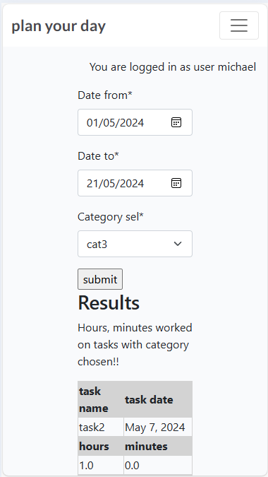

# Welcome

## Scope of project

This project aims to help you plan your day via timed tasks for today and tomorrow. When you first start it, register and login you will be on the home page and it will show a blank task list where you can add tasks for today. But the real power in this task list is to plan the next days workload the night before. This will allow a daily schedule for a say developer to follow!.

Note: That the tasks are timed and it will be possible to show stats on a daily/weekly/monthly basis. For instance how many hours in the week did you work on Code Institute's LMS. How many hours did you work on PP4 etc!.

## Epics
- 1. As a customer of the site I can register an account and then I have the ability to login and logout
- 2. As a customer of the site I can manage tasks and categories via forms
- 3. As a customer once I have entered tasks with categories I can view statistics on a task category by a given time frame
- 4. As a customer I can view the site and use the about nav link and I can fill in the form to contact the site owner

## User Stories

- 1. Account registration: As a site user I can register an account so that I can login and manage tasks and categories of a task
    - with a registration form with user, email and password fields a user can register an account request
    - then the user can login
    - when the user is logged in they can view and manage tasks and categories of task

- 1. Login/Logout: As a site user I can login and logout of the site given correct details
    - As a registered User of the site I can login and logout

- 2. Manage tasks: As a site user once logged in I can create, read, update and delete tasks so that I can manage my task list
    - As a logged in user. I can create a task
    - As a logged in user. I can read my tasks and notes
    - As a logged in user. I can update a task
    - As a logged in user. I can delete a task

- 2. Manage categories: As a site user once logged in I can create, read, update and delete categories so that I can manage category lists to be able to organize tasks better
    - As a logged in user. I can add a category
    - As a logged in user. I can view categories
    - As a logged in user. I can update a category
    - As a logged in user. I can delete a category: CAUTION HERE: As in the entity relationship diagrams I have it wired so that if there is tasks with this category the tasks will also be deleted!!.

- 2. Open a task: As a site user, I can click on a task so that I can read the notes related to a task
    - When the task in the task list is clicked on a detailed view of the task is shown with the notes for the task visible.

- 2. Modify or delete a task: As a site user I can modify and delete a task
    - As a logged in user, The user can modify their task
    - As a logged in user, The user can delete a task

- 3. View statistics: As a site user once logged in, I can click on the view stats nav link and view stats
    - As a logged in user. I can from a form select a category of task and the amount of days I want to run the summing for and the end result is to get a stat with the number of minutes and hours spent at that task in the given time frame

- 4. View About Site Link: As a site user I can click on the about nav link to see the about site details
    - As a site user I can view the about details of the site
    - As a site user I can fill in the contact site form

[Goto Top](#welcome)

## Design

The design of this system was to create a basic task manager with ease of use and to be able to generate statistics with ease.

## Color Scheme

This system was kept basic. So the Color scheme was also basic with light shades and for tasks in the accordion shades of blue was chosen to be easy on the eyes. The Delete button was set to red to indicate danger and the edit button to green to indicate a safe edit.

## Typography

The fonts used for this system were plain and simple easy to read and look pleasant to the eye.

[Goto Top](#welcome)

## Entity Relationship Diagrams ERD's

## Wireframes

Home and Login
Desktop

Mobile

[Goto Top](#welcome)

About and Contact Form
Desktop

Mobile

[Goto Top](#welcome)

Register
Desktop

Mobile

[Goto Top](#welcome)

Task List Home
Desktop

Mobile

[Goto Top](#welcome)

Categories List
Desktop

Mobile

[Goto Top](#welcome)

Add and Edit a Category
Desktop

Mobile

[Goto Top](#welcome)

Delete Category
Desktop

Mobile

[Goto Top](#welcome)

Add Edit and View Task
Desktop

Mobile

[Goto Top](#welcome)

Statistics
Desktop

Mobile

[Goto Top](#welcome)

Delete Task
Desktop

Mobile

[Goto Top](#welcome)

## Some bugs found while doing project

- Kanban board bug

If you look very closely at above image you will notice for instance under In progress EPIC 1 above the text EPIC 1 you can see django-blog. This is the repo that the kanban board is associated with. This is confusing as in repo plan-your-day if you click on Project then this Kanban board shows up.

In order to fix the above issue I had to delete all the entries in the Kanban board and as I was adding them again on a per instance basis I had to associate them with a repo plan-your-day. This was a very tricky bug and very easy to miss!!

- Database Unique=True issue

During my development of the database models I came across an issue where I set the category_name and task_name to unique. This seemed innocent enough as each user would have a unique set of tasks and categories. But this was not the full picture as at the database level each task_name and category_name has to be unique when the value is unique=True. So I was getting collisions when multi-user use was tested. My way of resolving the issue was to remove the unique=True from the models fields for category_name and task_name and to allow the user to manage the tasks and categories at their own discretion.

[Goto Top](#welcome)

## Features

### Header

#### Navigation bar

#### Navigation bar not logged in.

The navigation bar makes it easy to navigate the site. When not logged in you have the options Home, About, Register and Login.

#### Navigation bar logged in.

When logged in you can effectively use the system with navigation links Home, About, Categories, Statistics, View Date and Logout

### login and register pages

login screen desktop

login screen mobile

[Goto Top](#welcome)

### logout navbar choice

If you click on the logout navbar item the following image appears. Asking you to sign out.

if you click on Sign out it bring you to the Sign in page.

### Register page

If you click on the register navbar item you are brought to the register page which asks you for details, username, email and password.

register screen desktop

register screen mobile

[Goto Top](#welcome)

### Home Page

Home screen desktop

The navbar is a logged in navbar and the, you are logged in as user is the user logged in message. Below that is an Add Task link to an Add Task form. Below that is the Documentation button to open a bootstrap message modal to view a rough manual as to how to use the system. Below that is the task and day month date message which below of shows the tasks list for that date. If there is no tasks a No tasks for today message is displayed. The tasks are shown in an accordion where when you click on the task an accordion opens and shows the details of the task.

Home screen mobile

The Add Task link links to an Add Task form

Add Task form desktop

Add Task form mobile

This form assumes that you have created a category as a category is required in order to create a task. You can create a category by clicking on the navbar Categories item and then in the listing click on the Add Category button and add a category.

This Add Task form has a dropdown for choice of category followed by a task name and task description then an is urgent checkbox which when checked sn Urgent prompt will appear on the task minimized accordion view. Then the date of the task has to be selected and the start time and end time. Then there is a flag Finished task which is used when you open the details of the task and click on edit you can when the task is finished update the end time and select Finished task checkbox which puts a message on the accordion view Finished in the view date view it shows finished tasks but in the todays date (home) view the finished tasks no longer show up and it is a means to unclutter the screen.

Urgent prompt

Finished prompt

Note that the start time has to be less than the end time. If not a error prompt is shown prompting you to reset it.

Details of task1 desktop

Details of task1 mobile

[Goto Top](#welcome)

if you click on the Delete button a bootstrap modal opens prompting you if you want to delete the task

Delete task modal desktop

Delete task modal mobile

[Goto Top](#welcome)

if you click on the edit button the edit bootstrap modal appears to edit the task details

Edit task modal desktop

Edit task modal mobile

[Goto Top](#welcome)

If you click on task1 again the accordion closes and shows the briefs of the task.

[Goto Top](#welcome)

### About Page

The About page gives a basic introduction and below this introduction there is a contact form which submits to the database.

About page desktop

About page mobile

### Categories page

You can get a categories listing via clicking on the categories navbar item. If you have already created categories they will show up in a listing and if there is not categories created yet then a message No categories!! will display.

Categories listing desktop

Categories listing mobile

[Goto Top](#welcome)

If you click on the Add Category button the Add Category form appears

Add Category form desktop

Add Category form mobile

if you click on category delete button a delete modal appears

if you want to edit a category you select the edit green button and a bootstrap modal appears where you can edit the category name.

[Goto Top](#welcome)

### Statistics page

The statistics page is for the generation of statistics which is run based on category. When you run the stats you get a listing of each task under a given category and it show the amount of hours and minutes on each task and then at the end it shows the total hours and minutes within the time frame chosen on a particular category.

Statistics generation form desktop

Statistics generation form mobile

Statistics desktop

Statistics mobile

The statistics results is shown in tables with task name and task date and then the amount of hours and minutes for that task. Then at the end it shows the total hours and minutes for all the tasks within the time frame for the particular category.

[Goto Top](#welcome)

### View Date page

If you click on the view date navbar item you are brought to the view date form

View date form desktop

View date form mobile

View date desktop

View date mobile

Note that the finished tasks show up on view by date and do not show up on the home page. This is to unclutter the task view for today as when a task is finished it should not show up under the task listing for today.

[Goto Top](#welcome)

### Footer

The Footer is just to show a CopyRight notice and social media.

### 500 page

### 404 page

### 403 page

I also have a 403 error page which is similar to 500 and 404 but with the message, 403
        Ops you don't have access rights!!. please use the links to get back on track!!

[Goto Top](#welcome)

### Admin page

In the Django administration page it is possible for the superuser to administer the website as a whole. In this admin page it is possible to view all tasks and categories and to edit and delete them it is also possible to create them. It is also possible to edit and delete users and it is also possible to edit and update the about page contents. Note that when you submit the contact form on the About page it is possible for the superuser to view them by clicking on the contact form requests link and it shows all the contact requests.

[Goto Top](#welcome)

## The manual for the system.
 website url: https://plan-your-day-95966d08599e.herokuapp.com/

 when you load the above page it asks you to login or register to login

 login screen desktop

login screen mobile

[Goto Top](#welcome)

register screen desktop

register screen mobile

[Goto Top](#welcome)

once registered you can login

Home screen desktop

Home screen mobile

On the home screen it shows the navbar and under that the you are logged in as user user message and under that a button Add Task to add a task and under that another button Documentation to see a basic overview of how to use the system which shows up in a bootstrap message modal. Then under tasks Mon May 20 you see one task task1 with start time 13:07 and end time 14:07. Note the tasks are ordered ascending on start time. Then if you look down you see the footer with the copyright and social media.

[Goto Top](#welcome)

If you click on Add Task the Add Task form shows up

Add Task form desktop

Add Task form mobile

Note on this form that the start time must be less than the end time or a message pops up prompting you to change the start time. Also note that the categories listing in the dropdown combo box is categories specific to the logged in user. Also note that in order to add a task there must be at least one category created via clicking on the categories link on the navbar and then clicking on the Add Category button.

[Goto Top](#welcome)

categories listing via clicking on the categories navbar item

Categories listing desktop

Categories listing mobile

[Goto Top](#welcome)

if you click on the Add Category button the Add Category form appears

Add Category form desktop

Add Category form mobile

If you fill in the Add Category form and press Submit then you are presented with the categories listing. and a message Category submitted is prompted which you can click on the x button to close.

If after adding a category you return to the home page by clicking on the Home navbar item you are again presented with task1 if you click on task1 an accordion opens up and shows the details of the task for task1 in detail it shows the task name task1 in bold and directly under it is the task description and under that is the start time and end time of the task and then the buttons Delete to delete the task and edit to edit the details of task1

[Goto Top](#welcome)

Details of task1 desktop

Details of task1 mobile

[Goto Top](#welcome)

if you click on the Delete button a bootstrap modal opens prompting you if you want to delete the task

Delete task modal desktop

Delete task modal mobile

[Goto Top](#welcome)

if you click on the edit button the edit bootstrap modal appears to edit the task details

Edit task modal desktop

Edit task modal mobile

[Goto Top](#welcome)

If you click on task1 again the accordion closes and shows the briefs of the task.

If you click on the navbar item Statistics you are brought to the statistics generation form where you choose a from date and a to date to show the stats for that time frame you are also in a dropdown asked for the Category to run the stats for

Statistics generation form desktop

Statistics generation form mobile

Statistics desktop

Statistics mobile

The statistics results is shown in tables with task name and task date and then the amount of hours and minutes for that task. Then at the end it shows the total hours and minutes for all the tasks within the time frame for the particular category.

[Goto Top](#welcome)

If you click on the view date navbar item you are brought to the view date form

View date form desktop

View date form mobile

View date desktop

View date mobile

Note that the finished tasks show up on view by date and do not show up on the home page. This is to unclutter the task view for today as when a task is finished it should not show up under the task listing for today.

[Goto Top](#welcome)

## Testing

### Validation of code

### HTML

### Login page

### Register

### Home page

### About page

### Categories page

